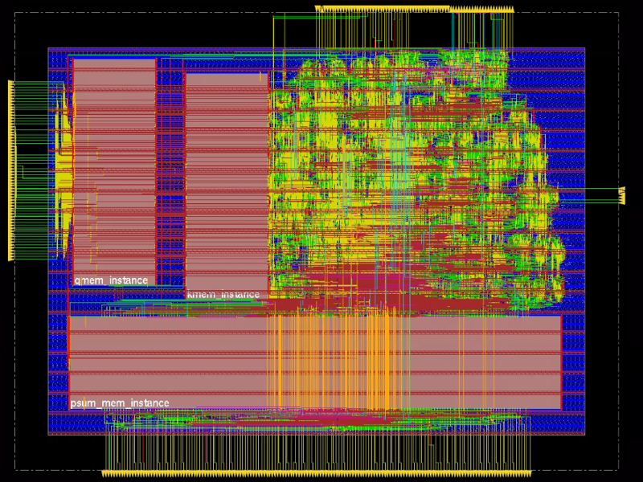
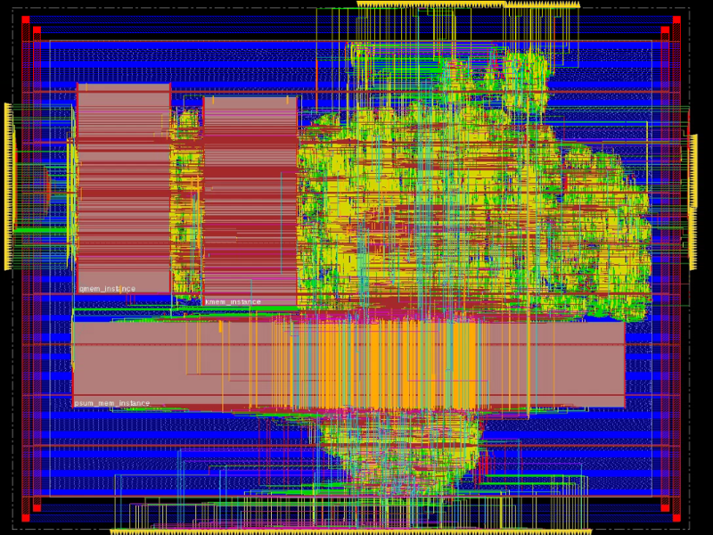

# 1D Vector based NPU

## Overview

1D Vector based NPU, final project of ECE 260B VLSI Integrated Circuits & Systems Design at UCSD

- The design aims to speed up Q * K calculation in **Transformer**
- For simplicity, we use **Normalization** in place of SoftMax
- The results are unsigned number
- The TechLibrary is **TSMC 65mm**

Tools:
- Synthesis: **Design Compiler**
- PnR: **Innovus**
- Gate-Level Simulation: **Xcelium**

## File Structure
The final Dual Core results are stored in:
```
Root Directory
├── dualCore_scan_chain
│   ├── gate_sim
│   ├── pnr
|   └── syn
├── dualCore_vanilla
│   ├── gate_sim
│   ├── pnr
|   └── syn
└── images
```

## Post Route Result

|           | Dual Core vanilla                          | With scan chain                                  |
| --------- | -------------------------------- | ------------------------------------------------ |
| core      |   |   |
| full chip |  |  |

